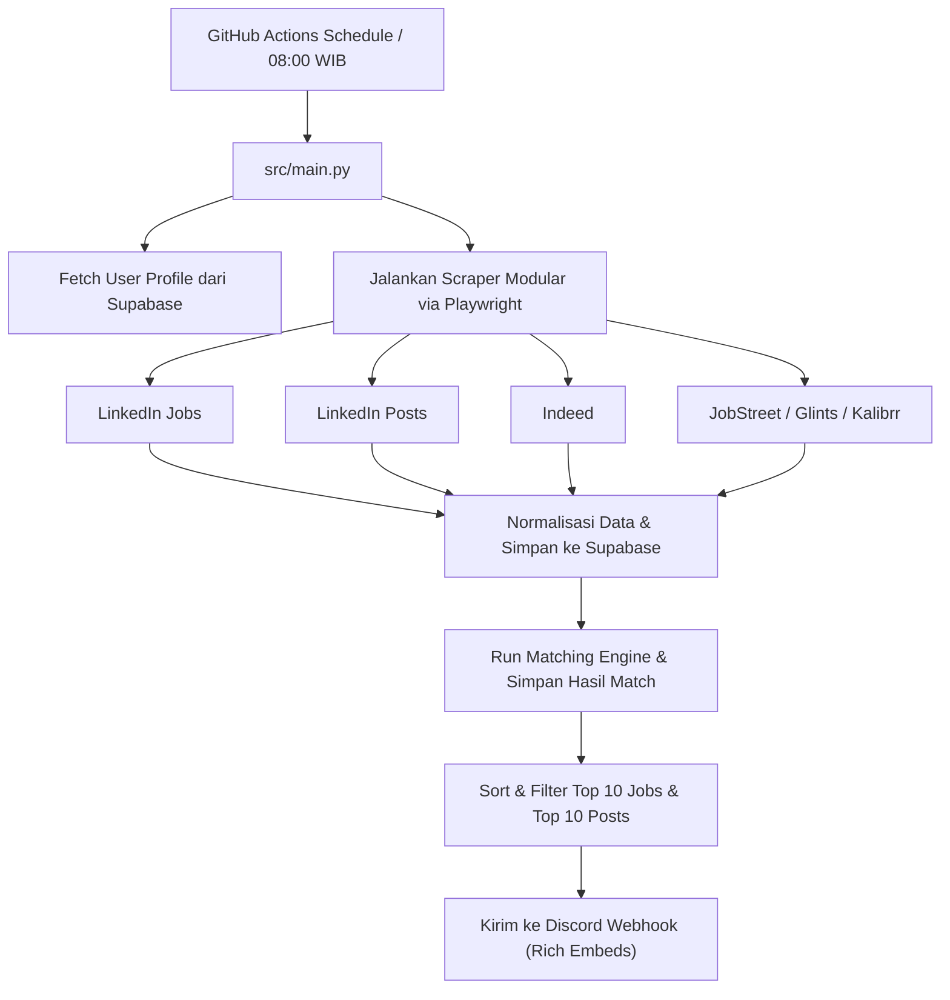

# 🤖 Advanced Job Hunter Agent

Sistem pencarian lowongan kerja otomatis berbasis **Python 3.12**, **Playwright**, **Supabase**, **Discord Webhook**, dan **GitHub Actions**. Berjalan 100% gratis tanpa VPS/Server 24/7.

---

## 🏗️ Arsitektur Sistem & Struktur Folder

Sistem menggunakan **Clean Architecture** dengan modularitas tinggi untuk mendukung ekspansi di masa depan.

```text
new/
├── .github/
│   └── workflows/
│       └── job_hunter.yml      # Scheduler GitHub Actions (Run setiap 08:00 WIB)
├── migrations/
│   └── 01_init.sql             # SQL script skema database Supabase
├── src/
│   ├── config/
│   │   └── settings.py         # Management variabel lingkungan
│   ├── database/
│   │   ├── supabase_client.py  # Inisialisasi Supabase
│   │   └── repository.py       # Operasi database (Tabel jobs, posts, sources)
│   ├── matching/
│   │   └── matcher.py          # Advanced rule-based matching engine
│   ├── scrapers/
│   │   ├── base_scraper.py     # Interface kelas dasar (search, extract, normalize, save)
│   │   ├── linkedin.py         # LinkedIn Jobs Scraper
│   │   ├── linkedin_posts.py   # LinkedIn Posts (Hiring Posts) Scraper
│   │   ├── indeed.py           # Indeed Jobs Scraper
│   │   ├── jobstreet.py        # JobStreet Scraper
│   │   ├── glints.py           # Glints Scraper
│   │   └── kalibrr.py          # Kalibrr Scraper
│   ├── discord/
│   │   └── notifier.py         # Discord Notifier (Embed report Jobs & Posts)
│   └── main.py                 # Entry point utama
├── .env.example
├── requirements.txt
└── README.md
```

---

## 🔄 Diagram Alur Kerja (Workflow Diagram)



---

## 🗄️ Database Skema & SQL Migration (`migrations/01_init.sql`)

```sql
-- Create jobs table
CREATE TABLE IF NOT EXISTS jobs (
    id UUID PRIMARY KEY DEFAULT gen_random_uuid(),
    source VARCHAR(50) NOT NULL,
    title VARCHAR(255) NOT NULL,
    company VARCHAR(255) NOT NULL,
    location VARCHAR(255),
    description TEXT,
    url TEXT UNIQUE NOT NULL,
    scraped_at TIMESTAMP WITH TIME ZONE DEFAULT CURRENT_TIMESTAMP
);

-- Create user_profile table
CREATE TABLE IF NOT EXISTS user_profile (
    id UUID PRIMARY KEY DEFAULT gen_random_uuid(),
    skills TEXT[] NOT NULL,
    preferred_roles TEXT[] NOT NULL,
    preferred_locations TEXT[] NOT NULL,
    created_at TIMESTAMP WITH TIME ZONE DEFAULT CURRENT_TIMESTAMP
);

-- Create job_matches table
CREATE TABLE IF NOT EXISTS job_matches (
    id UUID PRIMARY KEY DEFAULT gen_random_uuid(),
    job_id UUID REFERENCES jobs(id) ON DELETE CASCADE,
    score INT NOT NULL,
    matched_skills TEXT[] NOT NULL,
    created_at TIMESTAMP WITH TIME ZONE DEFAULT CURRENT_TIMESTAMP
);

-- Create linkedin_posts table
CREATE TABLE IF NOT EXISTS linkedin_posts (
    id UUID PRIMARY KEY DEFAULT gen_random_uuid(),
    author_name VARCHAR(255),
    author_profile_url TEXT,
    company VARCHAR(255),
    content TEXT NOT NULL,
    post_url TEXT UNIQUE NOT NULL,
    posted_at TIMESTAMP WITH TIME ZONE DEFAULT CURRENT_TIMESTAMP,
    created_at TIMESTAMP WITH TIME ZONE DEFAULT CURRENT_TIMESTAMP
);

-- Create job_sources table
CREATE TABLE IF NOT EXISTS job_sources (
    id UUID PRIMARY KEY DEFAULT gen_random_uuid(),
    source_name VARCHAR(100) UNIQUE NOT NULL,
    last_scraped_at TIMESTAMP WITH TIME ZONE DEFAULT CURRENT_TIMESTAMP,
    status VARCHAR(50) NOT NULL
);
```

---

## 🧠 Aturan Matching Engine & Prioritisasi

Skor kecocokan dihitung secara deterministik (skala 0-100) menggunakan aturan:
1. **Skills Match (50%)**: Persentase skill pengguna yang ditemukan di title/description.
2. **Role Match (20%)**: Kecocokan nama peran (role) yang diinginkan dengan judul lowongan.
3. **Location Match (10%)**: Kecocokan lokasi lowongan dengan lokasi preferensi pengguna.
4. **Seniority Match (10%)**: Verifikasi kecocokan tingkat pengalaman (Senior/Junior).
5. **Keyword Relevance (10%)**: Deteksi kata kunci pendukung (misal: "remote", "immediately").

**LinkedIn Posts Prioritization**: Posting-an LinkedIn yang memuat frasa kunci mendesak (seperti *hiring immediately*, *urgently hiring*, *referral*, dll.) akan mendapatkan **boost nilai sebesar +15 poin** (maksimal akumulatif 100).

---

## 🛠️ Panduan Setup & Uji Coba (Testing)

### 1. Setup Supabase
1. Buat proyek baru di [Supabase](https://supabase.com/).
2. Eksekusi file [01_init.sql](file:///e:/antigravity%20excel/new/migrations/01_init.sql) melalui menu **SQL Editor**.
3. Ambil URL dan API Key proyek Anda pada menu settings API.

### 2. Setup Discord Webhook
1. Di server Discord Anda, pilih text channel (misal: `#job-alerts`).
2. Klik **Edit Channel** -> **Integrations** -> **Webhooks** -> **Create Webhook** -> salin URL webhook.

### 3. Setup Konfigurasi Lokal
Buat file `.env` di root folder Anda:
```env
SUPABASE_URL=https://xxxx.supabase.co
SUPABASE_KEY=your-supabase-key
DISCORD_WEBHOOK_URL=https://discord.com/api/webhooks/xxxx/yyyy
```

### 4. Menjalankan Pengujian Lokal (Testing)
```bash
pip install -r requirements.txt
playwright install chromium
python src/main.py
```

---

## 🚀 Panduan Deploy ke GitHub Actions
1. Daftarkan kredensial Supabase dan Discord Webhook sebagai Secrets repositori GitHub Anda di **Settings** -> **Secrets and variables** -> **Actions**:
   - `SUPABASE_URL`
   - `SUPABASE_KEY`
   - `DISCORD_WEBHOOK_URL`
2. Push seluruh folder ke GitHub repositori Anda.
3. Trigger secara manual atau tunggu trigger cron harian setiap pukul 08:00 WIB (01:00 UTC).

---

## 🔮 Rencana Arsitektur Masa Depan (Future Features)

Struktur Clean Architecture pada sistem ini dirancang mudah diekspansi untuk fitur masa depan:
- **Easy Apply Automation & Cover Letter Generation**: Integrasi dengan pustaka LLM/OpenAI API yang dikelola melalui use-case layer baru di `src/automation/` untuk memproses auto-form filling Playwright dan mempersonalisasikan cover letter menggunakan resume pengguna.
- **Discord Slash Commands**: Menambahkan bot gateway menggunakan `discord.py` di folder `src/discord/commands.py` untuk menerima trigger interaktif pengguna (seperti `/profile` atau `/search`).
- **Company Career Page Scraping**: Menambahkan provider scraper baru di `src/scrapers/career_pages.py` untuk secara dinamis membaca XML sitemaps dari portal karir perusahaan.
